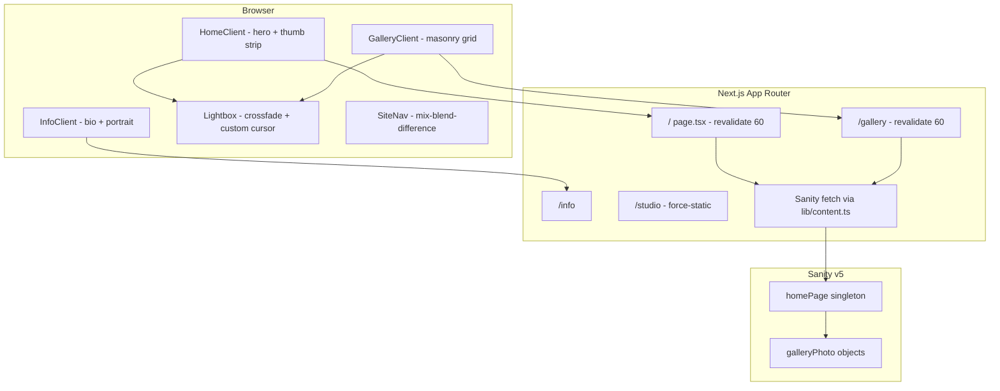

# Malik Laing — Case Study

> **Verified:** Production URL **https://www.maliklphoto.xyz/** (live site). Repo: `heavybag555/malik-portfolio`.  
> **Verified:** Solo build by Benjamin Uribe (`heavybag555`, 69 commits) + 1 Vercel deploy commit + 1 co-author credit.  
> **Context from Ben:** Met Malik through a Riverside Art Museum zine contract in 2025 (Ben designed a story featuring Malik). Stayed in touch; Ben kept the door open to build a portfolio site when Malik was ready.  
> **Audience:** Portfolio / studio site.

---

## 1. One-liner options

| Version | Copy |
|--------|------|
| **Short** | A photography portfolio for Malik Laing — hover a filmstrip of thumbnails to fill the screen, browse a Sanity-backed gallery, and read his story on a typographic info page. |
| **Medium** | A Next.js portfolio for independent photographer Malik Laing: full-bleed hero with thumbnail-driven image swaps, responsive masonry gallery, custom cursor lightbox, and embedded Sanity Studio — so Malik can reorder and caption work without touching code. |
| **Technical** | Next.js 16 + React 19 + Sanity v5 singleton CMS, Lenis smooth scroll, ISR (60s), dual-slot lightbox crossfade, mix-blend-difference nav, and a hardcoded editorial layer (bio, tagline, contact) with gallery-only CMS scope. |

---

## 2. The story

Malik Laing is an independent photographer from San Bernardino, California — community-rooted, Eclipse-project-deep, with work shown at the Riverside Art Museum and alongside The Civil Rights Institute of Southern California. Ben first met him through a contracted zine design for the Riverside Art Museum in 2025; the zine featured a story on Malik. They stayed in touch, and when Malik was ready for a proper portfolio, Ben built one.

The site at **maliklphoto.xyz** treats photography as something you *move through*, not just scroll past. On the home page, a vertical strip of thumbnails sits over a full-viewport hero; hover swaps the background image with a 600ms crossfade while inactive thumbs fall to grayscale. The gallery is a responsive grid with staggered fade-in. Both views open into a custom-cursor lightbox with `[PREV]` / `[NEXT]` / `[ESC]` labels and half-screen click zones.

The design intent is editorial and restrained: Helvetica Neue for UI, Times New Roman italic for the `", 2000"` birth-year accent and San Bernardino tagline, accent blue `#0043e0` on the cursor dot and mobile menu. Navigation uses `mix-blend-difference` so the header reads on any photograph underneath.

Sanity manages **only the gallery** — an ordered array of photos with title, location, year, and image. Tagline, bio, contact, and metadata stay in code so the site's voice stays fixed while Malik controls the work itself. That split matches the relationship: Ben built the frame; Malik fills it.

The stakes are personal, not commercial. This is a portfolio for a real photographer whose work already lives in institutional contexts — the site gives that work a home Malik can update himself.

---

## 3. Editorial / product arc

**Themes**
- **Community photography, institutional reach** — Eclipse project, Riverside Art Museum, Civil Rights Institute features in bio
- **Photography as spatial experience** — hero hover, lightbox navigation, Lenis scroll
- **Editorial typography** — serif accent on sans UI; birth year in nav
- **CMS scope discipline** — gallery in Sanity; identity copy in code

**Content structure**
1. Land on home → thumbnail strip + full-bleed hero
2. Hover thumbs → background crossfade; desktop click → lightbox
3. Gallery → masonry grid, stagger reveal, lightbox
4. Info → bio, portrait, Instagram + email
5. Studio (`/studio`) → Malik reorders and captions photos

**Pull quotes (from project copy)**

> **Photographer and director from**  
> *San Bernardino, California.*

> **Malik Laing [b. 2000] is an independent photographer hailing from San Bernardino, California.**

> **For years, he has been enveloped in the world of photography, inside and out. His lengthiest project, the community photography space Eclipse is a testament to the communal and personal themes in his work.**

> **Some of his material has been publicly featured at the Riverside Art Museum and alongside The Civil Rights Institute of Southern California.**

> **Photography portfolio of Malik** *(site metadata)*

---

## 4. Site architecture

### Mermaid — request & view flow

### Routes & pages

| Route | Type | Purpose |
|-------|------|---------|
| `/` | Server + client | Hero with thumbnail strip; hover swaps background; desktop lightbox |
| `/gallery` | Server + client | Responsive masonry grid; stagger fade-in; lightbox |
| `/info` | Server + client | Bio, portrait, Instagram + email; Lenis disabled |
| `/studio` | Static embed | Sanity Studio for gallery management; `robots: noindex` |

### Content / data model

| Entity | Source | Notes |
|--------|--------|-------|
| `galleryPhoto` | Sanity | Image (hotspot/crop), title, description (location), year |
| `homePage` | Sanity singleton | Ordered `photos[]` array — only CMS-managed content |
| Bio, tagline, contact | Hardcoded TSX | `InfoClient.tsx`, `HomeClient.tsx`, `SiteNav.tsx`, `layout.tsx` |
| `Project` (frontend) | `lib/content.ts` | Maps Sanity array to `id`, `title`, `description`, `image`, dimensions |
| Seed metadata | `app/photoMetadata.json` | 99 legacy entries for migration scripts only |

---

## 5. Technical deep dive

### Stack

| Layer | Technology | Version |
|-------|------------|---------|
| Framework | Next.js (App Router) | 16.0.10 |
| UI | React | 19.2.5 |
| Language | TypeScript | ^5 |
| Styling | Tailwind CSS | ^4 |
| CMS | Sanity + next-sanity | 5.21.0 / 12.3.0 |
| Scroll | Lenis | ^1.3.15 |
| Studio styling | styled-components | ^6.4.0 |

### Signature interactions

| Interaction | Implementation |
|-------------|----------------|
| **Hero thumb hover** | `HomeClient.tsx` — active index drives background `` opacity (600ms); inactive thumbs grayscale + 20% opacity |
| **Lightbox crossfade** | `Lightbox.tsx` — two-slot image swap; preload adjacent; 220ms enter / 180ms exit |
| **Custom cursor** | `CustomCursor.tsx` — desktop only (≥1024px); lerp-smoothed `#0043e0` dot; `[PREV]`/`[NEXT]`/`[ESC]` in lightbox |
| **Gallery stagger** | `GalleryClient.tsx` — IntersectionObserver + column-index × 100ms delay |
| **Mobile menu** | `SiteNav.tsx` — slides to 50vh `#0043e0` overlay |
| **Info scroll restore** | `OverlayWrapper.tsx` — `sessionStorage` + `BackgroundPlaceholder` gray block grid |
| **Page transitions** | `PageTransition.tsx` — 220ms opacity fade; disabled under `prefers-reduced-motion` |

### Performance & caching

- ISR: `revalidate = 60` on `/` and `/gallery`
- Sanity client: `useCdn: true`, `perspective: "published"`
- Next Image: 30-day `minimumCacheTTL`; AVIF/WebP; Sanity CDN max width 1600px
- `content-visibility: auto` on off-screen gallery items
- Lenis disabled on `/info` to avoid scroll conflicts with fixed layout

### Design system tokens

| Token | Value | Where |
|-------|-------|-------|
| Background | `#ffffff` | `--background` |
| Foreground | `#000000` | `--foreground` |
| Accent blue | `#0043e0` | Cursor, mobile menu |
| Muted gray | `#ACACAC` | Captions, inactive nav, arrows |
| Light gray | `#D0D0D0` | Secondary caption |
| Sans | Helvetica Neue stack | `.text-1`–`.text-3`, `.text-5` |
| Serif accent | Times New Roman italic | `.text-4` — `", 2000"`, tagline place name |
| Page padding | 20px | Nav, footers, grid gutters |
| Gallery row gap | 48px | Grid layout |
| Breakpoints | 768px, 1024px | Mobile / tablet / desktop |

---

## 6. Narrative angles

### Design portfolio
*"Photography as a filmstrip you can touch."* Focus on hero hover behavior, typographic pairing (Helvetica + Times), mix-blend-difference nav, and the restraint of a white field with one blue accent.

### Engineering portfolio
*"Sanity for the work, code for the voice."* Focus on singleton CMS model, ISR + CDN caching, lightbox preload/crossfade architecture, and responsive thumb-count logic tied to viewport width.

### Interaction / motion portfolio
*"Three speeds of looking."* Focus on hero crossfade, gallery stagger, lightbox half-screen navigation, custom cursor labels, Lenis on browse pages vs fixed info page.

### Cultural / mission portfolio
*"From Riverside Art Museum zine to living portfolio."* Focus on Malik's San Bernardino roots, Eclipse community space, institutional features, and a long-gestating collaboration — Ben kept the door open until Malik was ready.

---

## 7. Suggested case study structure (portfolio page)

1. **Hero** — One-liner + preview video + maliklphoto.xyz
2. **Origin story** — RAM zine contract, staying in touch, building when ready
3. **The experience** — Home hero, gallery grid, info page — one paragraph + clip each
4. **Lightbox & cursor** — Custom navigation, crossfade, keyboard support
5. **Editorial system** — Typography, tagline, nav treatment
6. **CMS model** — What Malik controls vs what's fixed in code
7. **Technical highlights** — Stack table + Sanity + ISR callouts
8. **Malik's work in context** — Eclipse, Riverside Art Museum, Civil Rights Institute
9. **Links** — Live site, Instagram, GitHub repo

---

## 8. Facts & figures

| Metric | Value | Source |
|--------|-------|--------|
| Public URL | maliklphoto.xyz | Live deployment |
| Package name | `malik-portfolio` | `package.json` |
| Dev period | Nov 19, 2025 – Apr 20, 2026 (~5 months) | `git log` |
| Commits | 71 | `git rev-list --count HEAD` |
| Primary contributor | heavybag555 (69 commits) | `git shortlog` |
| Source files (TS/TSX/CSS) | ~45 files, ~2,202 lines | `find` + `wc -l` |
| Legacy photo metadata entries | 99 | `app/photoMetadata.json` |
| App routes | 3 pages + `/studio` | `app/` |
| Sanity schema types (active) | 2 (`homePage`, `galleryPhoto`) | `sanity/schemaTypes/index.ts` |
| Largest components | `Lightbox.tsx` (278 lines), `HomeClient.tsx`, `GalleryClient.tsx` | file sizes |
| Local dev port | 3001 | `package.json` scripts |

---

## 9. Mission / about copy

**Site metadata (`app/layout.tsx`)**
> malik laing  
> Photography portfolio of Malik

**Tagline (Home + Gallery)**
> Photographer and director from  
> *San Bernardino, California.*

**Nav brand (`SiteNav.tsx`)**
> Malik Laing , 2000

**Bio (`InfoClient.tsx`)**
> Malik Laing [b. 2000] is an independent photographer hailing from San Bernardino, California.

> For years, he has been enveloped in the world of photography, inside and out. His lengthiest project, the community photography space Eclipse is a testament to the communal and personal themes in his work. Some of his material has been publicly featured at the Riverside Art Museum and alongside The Civil Rights Institute of Southern California.

**Contact**
> @maliklphoto — maliklphoto1@gmail.com

**Copyright**
> © 2026

---

## 10. Technical decisions worth calling out

| Decision | Rationale |
|----------|-----------|
| **Gallery-only Sanity scope** | Malik updates photos without risking brand/copy drift; editorial voice stays in code |
| **`homePage` singleton with ordered array** | One Studio entry; drag-to-reorder maps directly to front-end sequence |
| **Hardcoded bio/tagline/contact** | README explicitly documents this split; reduces CMS complexity for a single-artist site |
| **Native `` on hero background** | Instant crossfade swap; `next/image` used where optimization matters (grid, thumbs) |
| **Dual-slot lightbox** | Crossfade between current/next without layout flash; adjacent images preloaded |
| **Lenis disabled on `/info`** | Fixed full-viewport info layout + scroll restoration conflict with smooth scroll |
| **Custom cursor desktop-only** | Touch devices get standard interaction; cursor labels aid lightbox wayfinding |
| **ISR 60s** | Fresh gallery after Studio edits without full static rebuild on every caption change |
| **Mix-blend-difference nav** | Header stays legible over any photograph without a persistent bar fill |
| **Dev port 3001** | Avoids collision with other local Next apps (documented in README) |

---

## 11. Gaps to fill from memory

- [ ] **Exact launch date on maliklphoto.xyz** — repo latest commit Apr 20, 2026; confirm when domain went live
- [ ] **RAM zine details** — zine title, issue, Ben's specific design role, how Malik's story was framed
- [ ] **Timeline of conversations** — when Malik said yes, scoping calls, Figma vs code-first
- [ ] **Malik's editorial input** — which photos he prioritized, caption conventions, Studio training
- [ ] **Eclipse project** — one sentence on what Eclipse is for readers unfamiliar with the space
- [ ] **Director credit** — tagline says "photographer and director"; any video/directorial work to feature?
- [ ] **Photo count at launch** — how many images in live Sanity vs 99 in seed JSON
- [ ] **Future scope** — shop, booking, blog, or stay gallery-only?

---

## 12. Sample opening paragraph

> I first met Malik Laing through a Riverside Art Museum zine I was hired to design in 2025 — his story was one of the features inside. We stayed in touch, and I told him I'd build his portfolio whenever he was ready. When that moment came, I wanted the site to feel like his photographs: direct, community-rooted, and worth slowing down for. **maliklphoto.xyz** opens on a full-bleed hero driven by a filmstrip of thumbnails — hover to swap the image, click to enter a custom-cursor lightbox. The gallery is Sanity-backed so Malik can reorder and caption work himself; the voice of the site — his San Bernardino story, his Eclipse project, his museum features — stays fixed in code. It's a small site with a long backstory, built for a photographer whose work was already in institutional spaces and deserved a home he could own.
